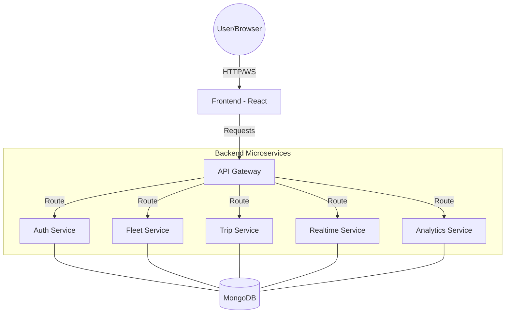

# 🏗️ FleetFlow Project Flow & Setup Guide

This guide provides a comprehensive overview of the FleetFlow architecture and step-by-step instructions to get the system running.

---

## 📐 Project Architecture

FleetFlow follows a **Microservices Architecture**. All communication between the frontend and backend services is routed through a central API Gateway.



---

## 📋 Prerequisites

Before starting, ensure you have the following installed:
- [Node.js](https://nodejs.org/) (v18 or higher)
- [MongoDB](https://www.mongodb.com/try/download/community) (Running locally or a Cloud Atlas URI)
- [Git](https://git-scm.com/)

---

## 🛠️ Step 1: Installation

You need to install dependencies for **every** component since they are independent.

1.  **Install Gateway dependencies:**
    ```bash
    cd api-gateway
    npm install
    ```
2.  **Install all Backend Service dependencies:**
    *Repeat for each folder in `backend-services/` (auth, fleet, trip, realtime, analytics)*
    ```bash
    cd backend-services/auth-service
    npm install
    # ... repeat for others
    ```
3.  **Install Frontend dependencies:**
    ```bash
    cd frontend
    npm install
    ```

---

## 🚀 Step 2: Running the Project

You will need to open **multiple terminal windows** (one for each service).

### Order of Startup:
1.  **MongoDB**: Ensure your database is running.
2.  **API Gateway**:
    ```bash
    cd api-gateway
    node index.js
    ```
3.  **Microservices**: (Open 5 separate terminals)
    - `cd backend-services/auth-service && node index.js`
    - `cd backend-services/fleet-service && node index.js`
    - `cd backend-services/trip-service && node index.js`
    - `cd backend-services/realtime-service && node index.js`
    - `cd backend-services/analytics-service && node index.js`
4.  **Frontend**:
    ```bash
    cd frontend
    npm run dev
    ```

---

## 🧭 Step 3: Application Flow (How to use)

1.  **Access the App**: Open the link shown in the frontend terminal (usually `http://localhost:5173`).
2.  **Authentication**: Start by creating an account or logging in via the **Login Page**.
3.  **Command Center**: After login, you'll land on the Dashboard showing high-level stats.
4.  **Live Tracking**: Navigate to the **Live Map** to see vehicles moving in real-time (uses Mapbox).
5.  **Fleet Management**: Go to **Vehicle Registry** to add or manage your vehicles.
6.  **Analytics**: View performance charts and data insights in the **Analytics** section.

---

## 💡 Troubleshooting

- **CORS Errors**: Ensure the API Gateway is running first.
- **Connection Errors**: Check that your MongoDB URI in `.env` files is correct.
- **Port Conflicts**: If a port is already in use, you can change it in the service's `.env` file.

---

**Happy Developing! 🚀**
